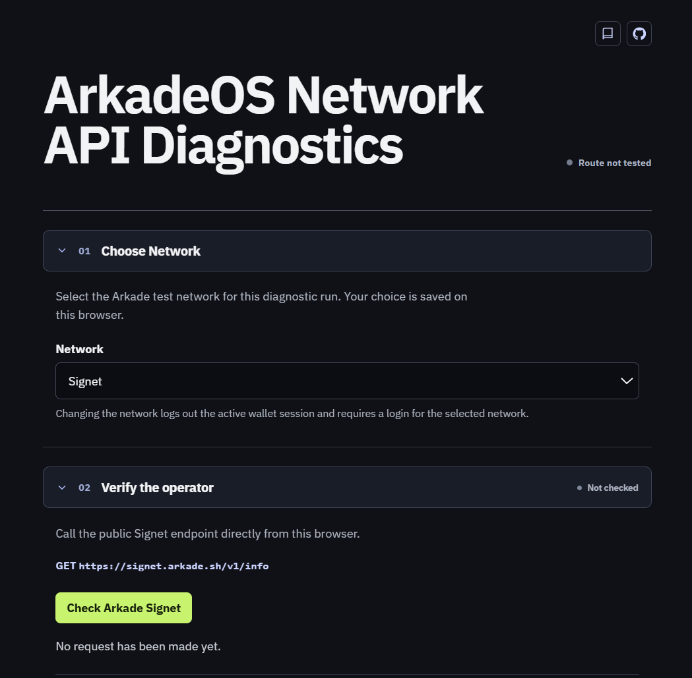

<!-- AI: This README documents the implemented static detector. Keep the creator banner and section order. -->

# Arkade OS Network Diagnostics

A browser-only React diagnostic for Arkade Signet and Mutinynet. Its masthead is **ArkadeOS Network API Diagnostics**. It keeps an encrypted browser-local wallet session for the selected network and exposes public operator reads with their raw response.

## Images

## Demo

* [Arkade OS Network Diagnostics](https://samuelasherrivello.github.io/blockchain-arkade-network-diagnosis/)

## Table of Contents

1. [Getting Started](#getting-started)
2. [Project Overview](#project-overview)
3. [Project Details](#project-details)
4. [Resources](#resources)
5. [Credits](#credits)

## Getting Started

Requires Node.js 24 or newer.

### 🛠 Build Project

1. Run `npm ci` from the repository root.
2. Run `npm run build`.

### 🛠 Run Project

1. Run `npm run dev` from the repository root.
2. Open the localhost URL printed by Vite.

### 🛠 Release Version

1. Run `npm test` and `npm run build`.
2. Push `main`; the GitHub Pages workflow deploys the `dist` folder.
3. Create a GitHub release from the verified version tag.

## Project Overview

Step 01, **Choose Network**, provides a Signet or Mutinynet dropdown before diagnostics begin. The React interface saves that non-sensitive preference in local storage, verifies the selected public operator, attaches a wallet only for that same network, then provides **04. Batch Operations** before basic, asset, and contract operations. With a wallet attached, **Start New Batch** updates its fixed-height, scrollable read-only progress field after each wallet-backed diagnostic in page order: **Check Balance**, **Onboard Balance**, **List Wallet Activity**, **Check Asset Prerequisites**, **List Owned Assets**, **Create and Verify Demo Asset**, **List Contracts**, and **Create Demo Contract**. It stops only after a blocked, unavailable, unknown, or failed result. Onboarding and an unverified asset issue remain awaiting independent confirmation; neither is displayed as settled merely because its request was submitted. **Clear Last Batch** removes completed progress from the page only and never cancels an Arkade operator intent or alters the encrypted wallet session. Changing the network removes the active wallet session and its in-memory diagnostic records, including batch progress, and requires a new login. Each operation displays its returned output and the explicit verdict **Backend reachable: yes** or **Backend reachable: no**. A `yes` requires a reachable response that identifies itself as the selected network.

Use **Check Arkade Signet** or **Check Arkade Mutinynet** to call the selected public `/v1/info` endpoint from the current browser. The result distinguishes an unavailable browser request from evidence of an operator-wide outage.

Use **Log in** to enter a recovery phrase with spaces between each word. The phrase is normalized in memory, used to derive the selected-network Arkade and Bitcoin boarding addresses, then cleared from the form. The wallet view provides the matching Signet or Mutinynet faucet beside that network's boarding address; it never adds the address to the external link. The encrypted browser-local session can be removed with **Log out**; the phrase is never logged or sent to a project server.

**Create and verify a demo asset** is an explicit write: it issues one fixed, non-reissuable DTEST asset and immediately reads the wallet balance. The result reports `ownershipVerified: true` only when that issued asset is visible in the attached wallet. **Create demo receive contract** creates a fresh one-wallet default receive contract/address that can receive funds; it does not pretend that a two-party or funded contract exists.

### 📝 Documentation

- `README.md`: Setup, deployment, and wallet-handling behavior.

### 📝 Structure

- `src`: React UI, reusable operation components, public operator probes, encrypted local session handling, and wallet operations.
- `test`: Focused Node tests for phrase normalization, operator results, session handling, and the React diagnostic flow.
- `.github/workflows`: GitHub Pages deployment workflow.

## Project Details

The Vite application uses React and the Arkade SDK only in the browser. It probes the selected public `/v1/info` endpoint with a 15-second timeout, then uses that verified route for operator, balance, asset, activity, and contract diagnostics. State-changing actions remain explicit button clicks. A supplied phrase is encrypted only in the detector's browser storage, not written to web storage or a project backend. The selected network is the only value stored in web storage.

### 📦 AI

- [Codex](https://openai.com/codex/): Assisted implementation and verification.

### 📦 Packages

- [Arkade SDK](https://github.com/arkade-os/sdk): Derives selected-network wallet addresses and performs the explicit demo actions in the browser.
- [React](https://react.dev/): Renders the operator, wallet, and account-operation diagnostics.
- [Vite](https://vite.dev/): Builds the static GitHub Pages site.

## Resources

- [Arkade documentation](https://docs.arkadeos.com/) - Operator and wallet documentation.
- [Arkade Signet info endpoint](https://signet.arkade.sh/v1/info) - The Signet public operation this detector checks.
- [Arkade Mutinynet info endpoint](https://mutinynet.arkade.sh/v1/info) - The Mutinynet public operation this detector checks.
- [Best Practices](https://www.SamuelAsherRivello.com/best-practices/) - Procedures prescribed as the most effective.

## Credits

### 💡 Contributors

- Samuel Asher Rivello - Over 25 years of game development XP (2026)

### 💡 Contact

- [LinkedIn.com/in/SamuelAsherRivello](https://Linkedin.com/in/SamuelAsherRivello) ⭐
- [GitHub.com/SamuelAsherRivello](https://github.com/SamuelAsherRivello/)
- [Twitter.com/srivello](https://twitter.com/srivello/)
- Resume / Portfolio: [SamuelAsherRivello.com](http://www.SamuelAsherRivello.com)

### 💡 License

- Provided as-is under the [MIT License](LICENSE).
- Copyright © 2026 Rivello Multimedia Consulting, LLC.
